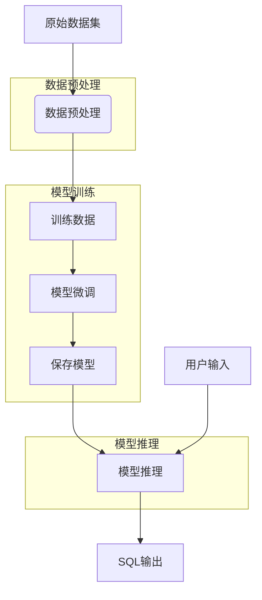
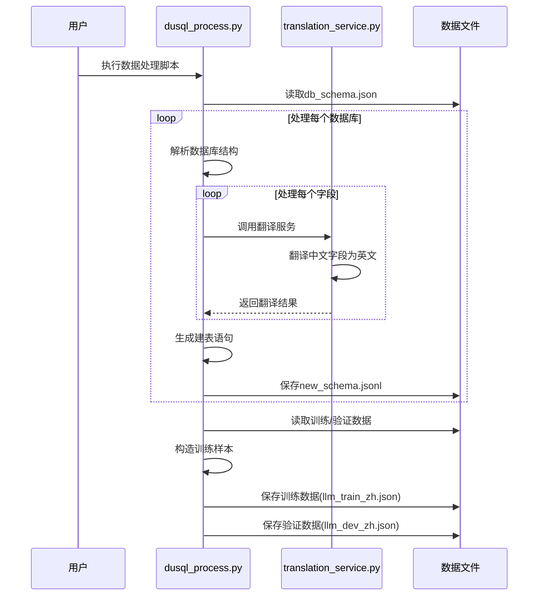
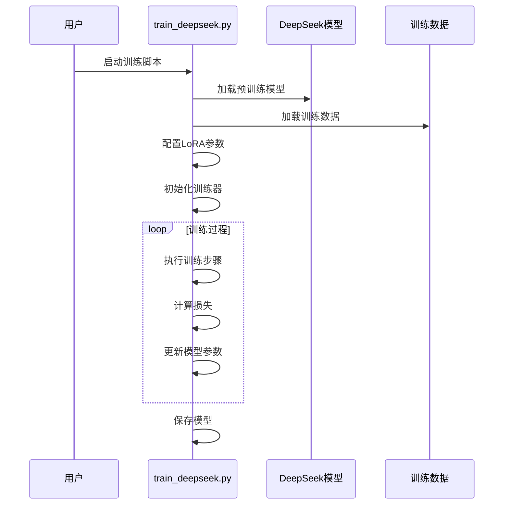
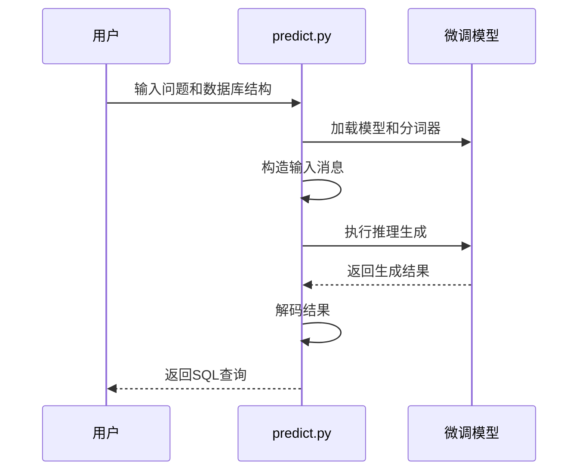

## 项目简介

本项目是基于DeepSeek Coder进行SQL生成任务的微调实现。利用DeepSeek Coder模型从开源数据中进行数据构造，并进行模型微调，实现从自然语言到SQL语句的生成（Text2SQL）任务。

项目主要结构如下：
- data：存放数据及数据处理的文件夹。
  - CSpider、DuSQL、NL2SQL：三个数据集的原始数据
  - dusql_process.py：用于针对开源数据进行数据处理，生成训练集及验证集数据
  - translation_service.py：提供中文到英文的翻译服务
- finetune：模型训练的文件夹。
  - train_deepseek.py：使用DeepSeek Coder模型训练的函数。
- predict：推理所需的代码文件夹。
  - predict.py：利用已训练的模型进行模型生成的方法。

## 技术架构



## 训练数据集

项目支持以下三个数据集：

- NL2SQL
- CSpider
- DuSQL

### 数据集下载

```shell
wget --no-check-certificate https://dataset-bj.cdn.bcebos.com/qianyan/NL2SQL.zip
unzip NL2SQL.zip >/dev/null

wget --no-check-certificate https://dataset-bj.cdn.bcebos.com/qianyan/CSpider.zip
unzip CSpider.zip >/dev/null

wget --no-check-certificate https://dataset-bj.cdn.bcebos.com/qianyan/DuSQL.zip 
unzip DuSQL.zip >/dev/null
```

### 数据集结构

```shell
[ 288]  .
├── [ 288]  CSpider
│   ├── [190K]  License.pdf
│   ├── [723M]  db_content.json
│   ├── [957K]  db_schema.json
│   ├── [1.9M]  dev.json
│   ├── [113K]  gold_dev.sql
│   ├── [368K]  test.json
│   └── [ 16M]  train.json
├── [ 31M]  CSpider.zip
├── [ 288]  DuSQL
│   ├── [190K]  License.pdf
│   ├── [1.4M]  db_content.json
│   ├── [912K]  db_schema.json
│   ├── [6.1M]  dev.json
│   ├── [409K]  gold_dev.sql
│   ├── [906K]  test.json
│   └── [ 55M]  train.json
├── [ 288]  NL2SQL
│   ├── [190K]  License.pdf
│   ├── [124M]  db_content.json
│   ├── [ 15M]  db_schema.json
│   ├── [3.0M]  dev.json
│   ├── [521K]  gold_dev.sql
│   ├── [1.9M]  test.json
│   └── [ 28M]  train.json
├── [ 21M]  NL2SQL.zip
├── [7.3K]  dusql_process.py
└── [1.1K]  translation_service.py

4 directories, 25 files
```

### 数据样例

```json
{
    "db_id": "69cc8c0c334311e98692542696d6e445",
    "question": "2011年平均每天成交3.17的长沙在最近一个星期成交了多少",
    "question_id": "qid2",
    "sql": {
        "agg": [
            0
        ],
        "cond_conn_op": 1,
        "sel": [
            6
        ],
        "conds": [
            [
                2,
                2,
                "3.17"
            ],
            [
                1,
                2,
                "长沙"
            ]
        ]
    },
    "query": "SELECT 近7日成交 WHERE 2011年日均成交 == \"3.17\" and 城市 == \"长沙\""
},
{
    "db_id": "4d258a053aaa11e994c3f40f24344a08",
    "question": "请问 一下搜房网和人人网的周涨跌幅分别是多少",
    "question_id": "qid7",
    "sql": {
        "agg": [
            0
        ],
        "cond_conn_op": 2,
        "sel": [
            5
        ],
        "conds": [
            [
                2,
                2,
                "搜房网"
            ],
            [
                2,
                2,
                "人人网"
            ]
        ]
    },
    "query": "SELECT 周涨跌幅 WHERE 名称 == \"搜房网\" or 名称 == \"人人网\""
}
```


## 核心流程详解

### 1. 数据处理流程



#### 核心数据加载代码说明

数据处理主要在[dusql_process.py](data/dusql_process.py)中完成，关键代码如下：

```python
# 翻译服务，将中文文本翻译为英文并格式化
def translation_service(self, text):
    result = self.translation.translate(text)
    en_query = result.strip(".").replace(".", " ").replace(",", " ")
    en_query = en_query.replace(" ", "_")
    return en_query

# 生成用于大语言模型训练的数据
def make_llm_data(self, file_name, save_name, sqlite_info_name="sqlite_info_zh.json"):
    llm_data = []
    # 加载SQLite信息
    with open(os.path.join(self.home_path, sqlite_info_name), 'r', encoding="utf-8") as f:
        sqlite_info = json.load(f)
    
    # 加载样本数据
    with open(os.path.join(self.home_path, file_name), 'r', encoding="utf-8") as f:
        samples = json.load(f)
        # 处理每个样本
        for sample in tqdm(samples):
            db_id = sample['db_id']
            question = sample['question']
            sql_query_zh = sample["sql_query"]
            sqlite_query = sqlite_info[db_id]["sqlite"]
            
            # 构建提示模板
            prompt = f"""### Instructions:
Your task is convert a question into a SQL query, given a Postgres database schema.
Adhere to these rules:
- **Deliberately go through the question and database schema word by word** to appropriately answer the question
- **Use Table Aliases** to prevent ambiguity. For example, `SELECT table1.col1, table2.col1 FROM table1 JOIN table2 ON table1.id = table2.id`.
- When creating a ratio, always cast the numerator as float

### Input:
Generate a SQL query that answers the question `{question}`.
This query will run on a database whose schema is represented in this string:
{sqlite_query}

### Response:
Based on your instructions, here is the SQL query I have generated to answer the question `{question}`:

"""            
```

### 数据处理执行

```shell
cd data
python3 dusql_process.py
```

## 2. 模型微调流程



#### 核心训练代码说明

模型训练主要在[train_deepseek.py](finetune/train_deepseek.py)中完成，关键代码如下：

```python
# 配置LoRA参数
config = LoraConfig(
    task_type=TaskType.CAUSAL_LM,          # 任务类型为因果语言模型
    target_modules=["q_proj", "v_proj"],   # 目标模块为注意力机制中的q和v投影层
    inference_mode=False,                  # 训练模式
    r=8,                                   # LoRA秩
    lora_alpha=32,                         # LoRA缩放因子
    lora_dropout=0.1                       # Dropout比例
)
# 使用LoRA配置包装模型
model = get_peft_model(model, config)

# 创建训练器
trainer = Trainer(model=model, tokenizer=tokenizer, args=training_args, **data_module)

# 开始训练
trainer.train()
# 保存训练状态
trainer.save_state()
# 保存模型
safe_save_model_for_hf_trainer(trainer=trainer, output_dir=training_args.output_dir)
```

### 模型微调执行

```shell
cd finetune
python3 train_deepseek.py --model_name_or_path "your_deepseek_model_path" \
                          --data_path "your_train_data_path" \
                          --output_dir ./save_files
```

## 3. 模型推理流程



#### 核心推理代码说明

模型推理在[predict.py](predict/predict.py)中完成，关键代码如下：

```python
def predict(self, sql_info, query):
    """
     sql_info: 建表语句
     query: 用户问题
    """
    messages = [
        {'role': 'user', 'content': f"{sql_info}\n{query}"}
    ]
    # 对输入进行编码
    inputs = self.tokenizer.apply_chat_template(messages, add_generation_prompt=True, return_tensors="pt").to(
        self.model.device)
    # 生成SQL查询
    outputs = self.model.generate(inputs, max_new_tokens=512, do_sample=False, top_k=50, top_p=0.95,
                                  num_return_sequences=1,
                                  eos_token_id=self.tokenizer.eos_token_id)
    # 解码生成结果
    result = self.tokenizer.decode(outputs[0][len(inputs[0]):], skip_special_tokens=True)
    return result
```

### 模型推理执行

```shell
cd predict
python3 predict.py --model_path "your_model_path"
```

## 总结

本项目基于DeepSeek Coder模型实现Text2SQL任务，通过LoRA微调技术在有限计算资源下高效训练模型。项目包含完整的数据预处理、模型训练和推理流程，具有以下特点：

1. **多数据集支持**：支持DuSQL、CSpider、NL2SQL等多个中文Text2SQL数据集
2. **中英文翻译**：通过翻译服务处理中文字段名，提高模型理解能力
3. **高效微调**：采用LoRA技术进行参数高效微调，降低计算资源需求
4. **完整流程**：提供从数据处理到模型推理的端到端解决方案
